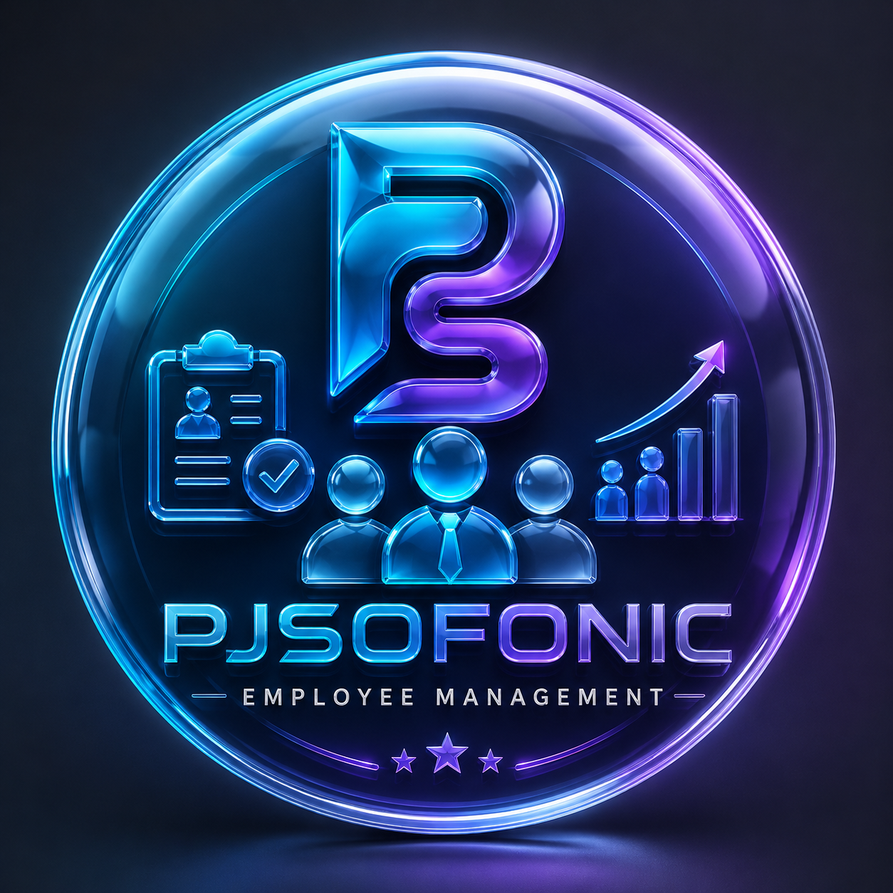

<div align="center">
  
  <h1>🚀 PJSOFONIC EMS - Enterprise Workforce Portal</h1>
  <p><strong>Official Employee Management System & Enterprise Portal</strong></p>
</div>

---

## ✨ Key Features

- **🔐 Flexible Sign-In**: Supports sign-in via **Employee ID**, **Username**, or **Email** with automatic first-login password update prompt.
- **🛡️ Role-Based Workspaces**: Separate interfaces for **Employees** (Shift tracking, Messaging, Tasks) and **Administrators** (Staff directory, Custom Punch, Reports, System Settings).
- **📋 Employee Credentials Modal**: Displays generated Employee ID and temporary password immediately after staff creation or password reset with a 1-click **Copy Credentials** button.
- **📄 Employee ID Download & Reports Section**:
  - Located under `/dashboard/reports` under the **Employee Credentials** tab.
  - Centered glassmorphic tab container with backdrop blur styling.
  - Branded PDF exports featuring official **PJSOFONIC EMS** headers, metadata, and page numbers (`jspdf`, `jspdf-autotable`).
  - Excel (`.xlsx`) & CSV export for employee credentials and attendance datasets.
- **⏱️ Attendance Override & Custom Punch Time**:
  - Force Punch-In & Punch-Out console for Admins.
  - Date-time picker for entering custom punch-in/out timestamps.
  - Edit Attendance Time modal for updating existing login/logout records with automatic shift and overtime calculation.
- **⚡ Real-Time WebSockets**:
  - Shared `SocketProvider` context (`contexts/SocketContext.tsx`).
  - Real-time updates on staff creation (`employee:update`), attendance logs (`attendance:update`), and live notifications (`notification:new`).
- **🔔 Live Notification Center**: Dedicated notifications feed (`/dashboard/notifications`) for viewing system announcements and shift updates.
- **💬 Staff Messaging & Meetings**: Live team chat and meeting scheduler for seamless internal communication.

---

## 🛠️ Tech Stack

- **Framework**: Next.js 15 (App Router)
- **Library**: React 18 & TypeScript
- **Styling**: Tailwind CSS & Glassmorphism UI System
- **Real-Time Client**: Socket.IO Client v4.7
- **HTTP Client**: Axios (with Auth Interceptors)
- **Icons & UI**: Lucide React
- **Document Generators**: `jspdf`, `jspdf-autotable`, `xlsx`

---

## ⚙️ Environment Variables

Create a `.env.local` file in the `frontend/` root directory:

```env
NEXT_PUBLIC_API_URL=http://localhost:5000/api
NEXT_PUBLIC_SOCKET_URL=http://localhost:5000
```

---

## 🚀 Getting Started

### 1. Installation

```bash
cd frontend
npm install
```

### 2. Run Development Server

```bash
npm run dev
```

Open [http://localhost:3000](http://localhost:3000) in your browser.

### 3. Production Build

```bash
npm run build
npm run start
```

---

## 📁 Directory Structure

```text
frontend/
├── app/
│   ├── change-password/      # Mandatory first-login password update page
│   ├── dashboard/            # Protected Dashboard routes
│   │   ├── attendance/       # Attendance tracking & admin custom punch modal
│   │   ├── chat/             # Real-time messaging platform
│   │   ├── departments/      # Department overview
│   │   ├── employees/        # Staff directory & generated credentials modal
│   │   ├── meetings/         # Team meeting scheduler
│   │   ├── notifications/    # Live notification center
│   │   ├── reports/          # Employee ID Credentials download & PDF/Excel exports
│   │   ├── settings/         # Profile & Security settings
│   │   ├── signout/          # Logout handler
│   │   ├── tasks/            # Task board
│   │   ├── layout.tsx        # Dashboard layout with Sidebar & Header
│   │   └── page.tsx          # Real-time stats & greeting dashboard
│   ├── login/                # Authentication page
│   ├── register/             # Account registration page
│   └── page.tsx              # Portal landing page
├── components/               # UI components & Sidebar
├── contexts/                 # AuthContext & SocketContext providers
├── lib/                      # Report PDF & Excel export generators
├── public/                   # Assets (EMS.png logo)
└── services/                 # Axios configuration & API service layers
```

---

## 📄 License

Copyright (c) 2026 **PJSOFONIC EMS**. All rights reserved.